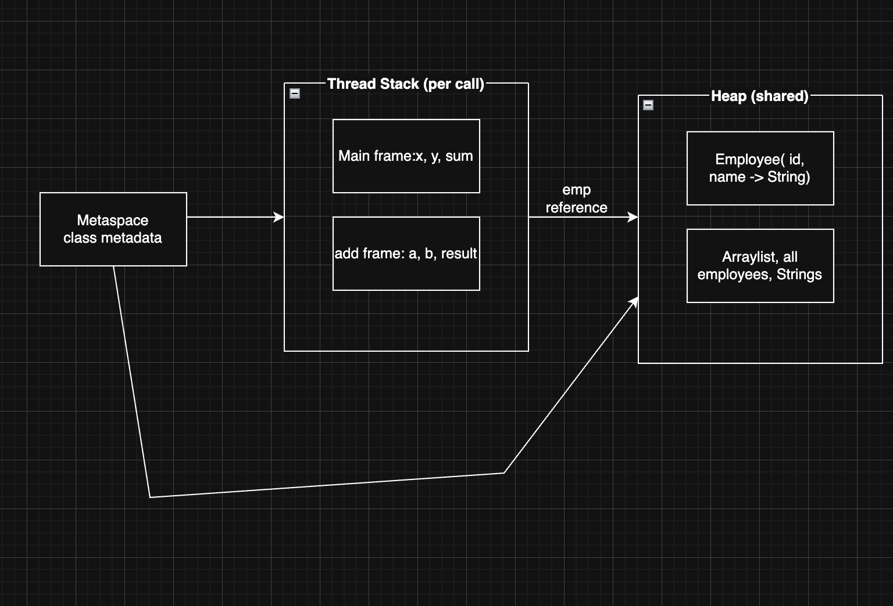
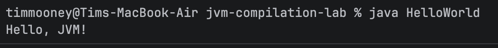
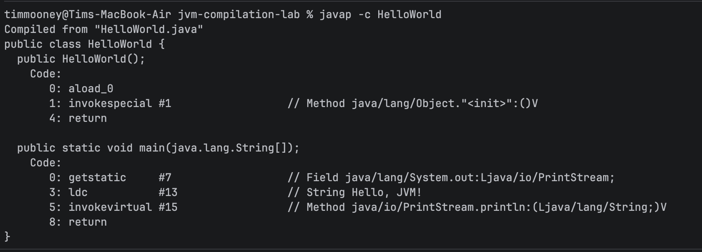
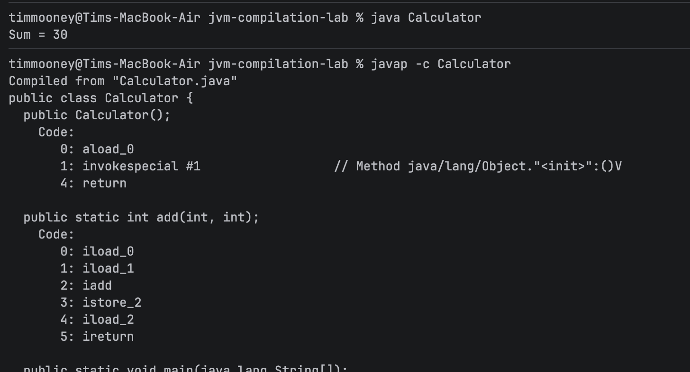
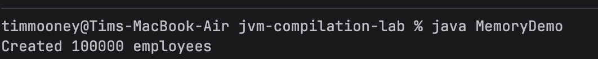
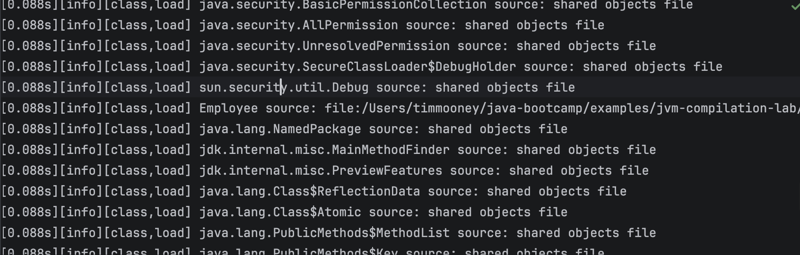
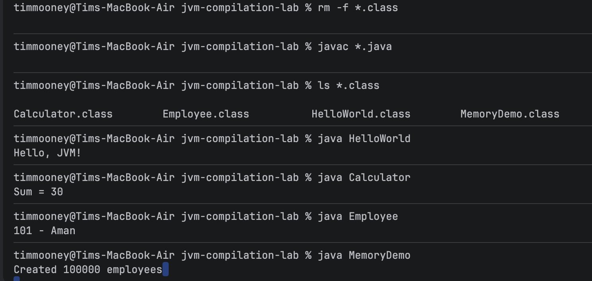

**What is the difference between HelloWorld.java and HelloWorld.class?**

HelloWorld.java is the code written in java and can be read and edited by a human. HelloWorld.class is the bytecode and cannot be understood by a human. Compiling the .java file creates the .class file.

1. Javac compiles a .java file into a .class file containing bytecode.
2. Machine readable code meant for execution.
3. It runs on the JVM so any OS can expect the same output.
4. Executing bytecode
5. The heap
6. The Stack
7. The JVM loads, verifies, and executes it.

timmooney@Tims-MacBook-Air jvm-compilation-lab % java --version\
openjdk 21.0.11 2026-04-21 LTS\
OpenJDK Runtime Environment Temurin-21.0.11+10 (build 21.0.11+10-LTS)\
OpenJDK 64-Bit Server VM Temurin-21.0.11+10 (build 21.0.11+10-LTS, mixed mode, sharing)

**CP A**

Renaming the .java file to World.java and compiling is an error because the file name and class name must match.
After you have compiled the .java file, the .class file is actually used to run the program. The .java file isn't needed.

**CP B**

This shows both ints being loaded into RAM, added together, and stored.

| Code element | Memory area |
| ------------ | ----------- |
| Locals `x`, `y`, `sum` in `main` | Stack (locals in `main` frame) |
| Parameters `a`, `b` and local `result` in `add` | Stack (`add` frame) |
| Method call `add(x, y)` | New stack frame pushed, then popped on return |
| Class metadata for `Calculator` | Metaspace (simplified course term) |
| Temporary `String` for `"Sum = " + sum` | Heap (String / builder intermediates) |

Calling add() pushes a frame to the stack and when add() returns it pops the frame.

Changing the .java file and rerunning without recompiling doesn't change anything because java Calculator runs the .class bytecode not the .java code.

**CP C**

If I add a 0 to MemoryDemo.java and make the heap 64mb it crashes with a OOM error but if I run it without limiting the heap size it runs. This demonstrates the heap size changing.

size_t InitialHeapSize                          = 268435456                                 {product} {ergonomic}\
size_t MaxHeapSize                              = 4294967296                                {product} {ergonomic}\
size_t SoftMaxHeapSize                          = 4294967296                             {manageable} {ergonomic}\
bool UseG1GC                                  = true                                      {product} {ergonomic}

The examples we have seen are relatively simple, but the overall structure of the memory stays the same in larger projects.

1. JVM runs bytecode and .java files are just to create the byte code. 
2. What is revealed by javap doesn't change, so it is best to understand it before working with tools that obscure it and expect you to already understand it.
3. mvn clean. I did this at my internships. Then recompile.
4. The JVM needs to start up before the application can be run.

